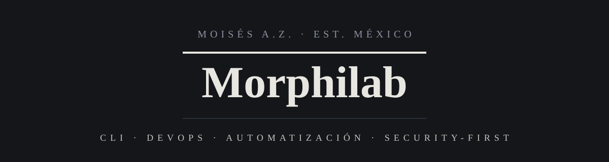

  

[English](README.md) · **Español**

 

**Hola, soy Moisés.** Construyo herramientas de código abierto para ingeniería de software, automatización y desarrollo asistido por IA.

---

### Sobre mí

Soy desarrollador de software en México y fundador de **Morphilab**, un pequeño laboratorio de código abierto. Mi trabajo abarca utilidades de línea de comandos y aplicaciones de escritorio, de la administración de sistemas a la ingeniería de software asistida por IA.

Me importan las opciones seguras por defecto, el código claro y que las cosas sean lo bastante simples para entenderlas.

---

### Stack

**Lenguajes**

**Herramientas**

**Sistemas**

---

### Destacado

<!-- BEGIN:destacado -->
**[morphix](https://github.com/Morphilab/morphix)** — Plataforma multi-agente de escritorio para ingeniería de software asistida por IA: motor de workflows determinista, 5 agentes, 24+ herramientas, pausas humanas y offline vía Ollama.

`Python` · `PostgreSQL` · `PySide6` · `MCP` · `LLMs`
<!-- END:destacado -->

---

### Índice de proyectos

<!-- BEGIN:proyectos -->
`01` · **[iterecho](https://github.com/Morphilab/iterecho)** · `Python`

> Procesador seguro de archivos: copiar, concatenar o dividir árboles con validación de seguridad.

`02` · **[nebulaforge](https://github.com/Morphilab/nebulaforge)** · `Python`

> Crea entornos Conda seguros y auditables.

`03` · **[sendorbit](https://github.com/Morphilab/sendorbit)** · `Shell`

> Orquestación SSH/SCP/Rsync security-first con TUI + CLI, backups automáticos y sanitización de inputs.

`04` · **[theduckpurge](https://github.com/Morphilab/theduckpurge)** · `Shell`

> Sanitizador de metadatos privacy-first (PDF, imágenes, Office, audio, video). 100% offline.

`05` · **[copycrow](https://github.com/Morphilab/copycrow)** · `Shell`

> Backups automatizados con Borg, TUI guiada, timers de systemd y cifrado del lado del cliente.

`06` · **[thefoxup](https://github.com/Morphilab/thefoxup)** · `Shell`

> Actualizador security-first de Debian/Ubuntu — local y remoto vía SSH, con protección por lock y ejecución en paralelo.
<!-- END:proyectos -->

---

### Cita

> *"Herramientas que automatizan, protegen y simplifican."*

---

### Contacto

---

**Open Source · Seguridad · Automatización**

© 2026 Moisés A.Z. / Morphilab · Hecho en México 🇲🇽

⭐️ Si algún proyecto te resulta útil, una estrella es bienvenida.

