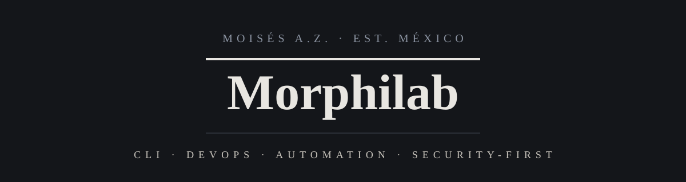

  

**English** · [Español](README.es.md)

 

**Hi, I'm Moisés.** I build open-source tools for software engineering, automation, and AI-assisted development.

---

### About me

I'm a software developer based in Mexico and the founder of **Morphilab**, a small open-source lab. My work spans command-line utilities and desktop applications, from systems administration to AI-assisted software engineering.

I care about secure defaults, clear code, and keeping things simple enough to understand.

---

### Stack

**Languages**

**Tools**

**Systems**

---

### Featured

<!-- BEGIN:destacado -->
**[morphix](https://github.com/Morphilab/morphix)** — Desktop multi-agent platform for AI-assisted software engineering: deterministic workflow engine, 5 agents, 24+ tools, human-in-the-loop, offline via Ollama.

`Python` · `PostgreSQL` · `PySide6` · `MCP` · `LLMs`
<!-- END:destacado -->

---

### Project index

<!-- BEGIN:proyectos -->
`01` · **[iterecho](https://github.com/Morphilab/iterecho)** · `Python`

> Secure file processor: copy, concatenate, or chunk file trees with security validation.

`02` · **[nebulaforge](https://github.com/Morphilab/nebulaforge)** · `Python`

> Forge secure, auditable Conda environments.

`03` · **[sendorbit](https://github.com/Morphilab/sendorbit)** · `Shell`

> Security-first SSH/SCP/Rsync orchestration with TUI + CLI, automatic backups, and input sanitization.

`04` · **[theduckpurge](https://github.com/Morphilab/theduckpurge)** · `Shell`

> Privacy-first metadata sanitizer (PDF, images, Office, audio, video). 100% offline.

`05` · **[copycrow](https://github.com/Morphilab/copycrow)** · `Shell`

> Automated backups with Borg, a guided TUI, systemd timers, and client-side encryption.

`06` · **[thefoxup](https://github.com/Morphilab/thefoxup)** · `Shell`

> Security-first Debian/Ubuntu updater — local and remote via SSH, with lock protection and parallel runs.
<!-- END:proyectos -->

---

### Quote

> *"Tools that automate, protect, and simplify."*

---

### Contact

---

**Open Source · Security · Automation**

© 2026 Moisés A.Z. / Morphilab · Made in Mexico 🇲🇽

⭐️ If any project is useful to you, a star is welcome.

